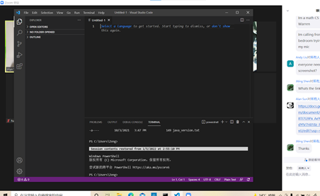
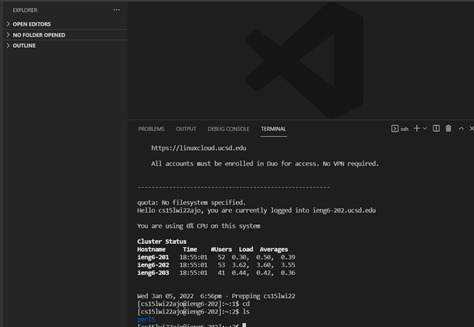
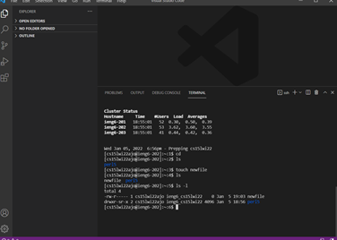
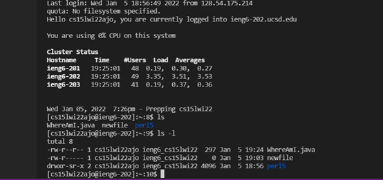
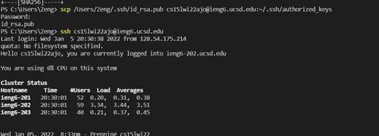
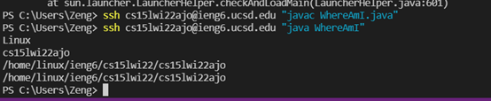

### https://github1s.com/WEIGUOZENG/cse15l-lab-reports/blob/main/lab-report-1-week-2.md

## Installing VScode

I downloaded and installed VScode on my local device. 
Then I learned to writing codes and commands with it.

## Remotely Connecting

I used my account and password for this class connect to the server remotely.
I saw the files in my account and some information such as their names and last times they are used.

## Trying Some Commands

I tried some commands after connecting to the server.
I learned some commands such as `ls -l` which shows the files with their information or `touch` to create new files.

## Moving Files with scp

After moving my file WhereAmI, I can find the file and its information on the server with `ls -l` command.
It shows different directory and user name on the server after compling it.

## Setting an SSH Key

I create a file to save the key on the client and copy it to the .ssh directory on server.
Then I try to connect to the server with my account on my computer and succeeded without entering the key.

## Optimizing Remote Running

After previous steps, I can conncect to my account on the server without password and directly run my file WhereAmI.
I used ssh command to compile and run WhereAmI on the client successfully.
I can run WhereAmI directly with 48 keystroke while it would take about 31 keystrokes and keystrokes for password to login and less than 20 keystrokes to run WhereAmI.
As a result, it would be more efficient to run the file remotely.
