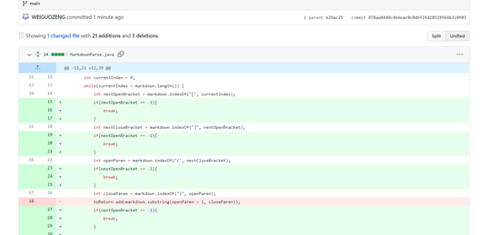
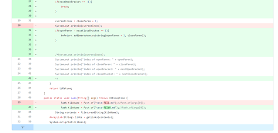
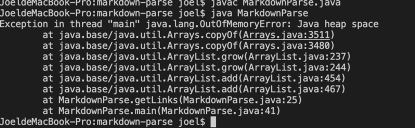
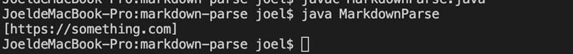

## changes

## links of test files
>[testfile2](https://github.com/WEIGUOZENG/markdown-parse/blob/main/test-file2.md)
>[testfile2](https://github.com/WEIGUOZENG/markdown-parse/blob/main/test-file3.md)
>[testfile2](https://github.com/WEIGUOZENG/markdown-parse/blob/main/test-file4.md)

## syptoms

the output should be all links in testfile4 instead of the first line.

The failure-inducing input can lead to the symptom. When there is a symptom, there is possible to be a bug in the program. 
