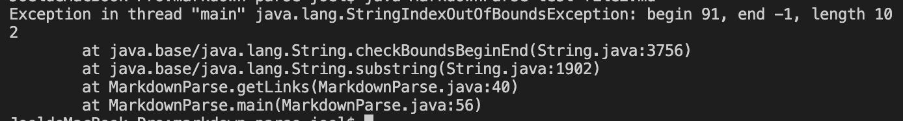

## changes

## links of test files
>[testfile2](https://github.com/WEIGUOZENG/markdown-parse/blob/main/test-file2.md)
>
>[testfile3](https://github.com/WEIGUOZENG/markdown-parse/blob/main/test-file3.md)
>
>[testfile4](https://github.com/WEIGUOZENG/markdown-parse/blob/main/test-file4.md)

## syptoms

the output should be all links in testfiles instead of only the first line.

The first syptom is because the infinite while loop does not stop when there is no brackets or parenthesis. So that it will be out of memory. So that there should be break when the index of these brackests or parenthesis is -1

The second syptom is because there is not close parenthesis at the end of the link so that it will be out of index when the loop is trying to find the index of a close parenthesis. So that null should be returned when there is close parenthesis.

the thirs syptom is because is because the code did not consider multiple links in one file and only read the first line in the file. So that there should be a loop that keep reading the file when there are contents.
