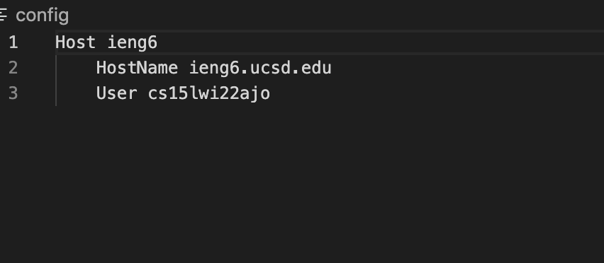
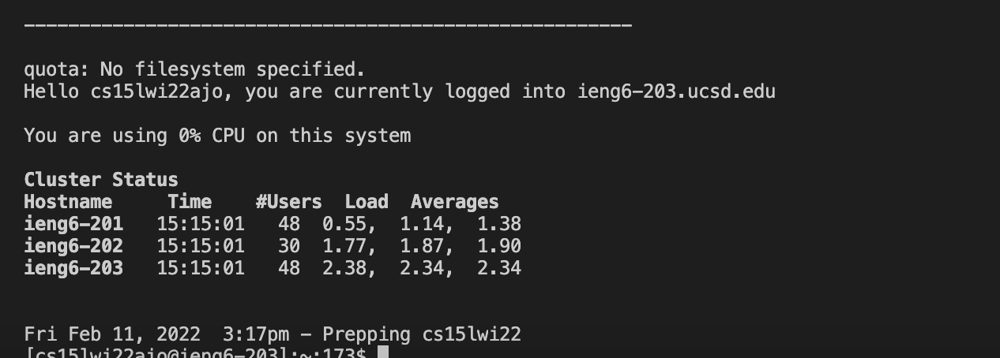
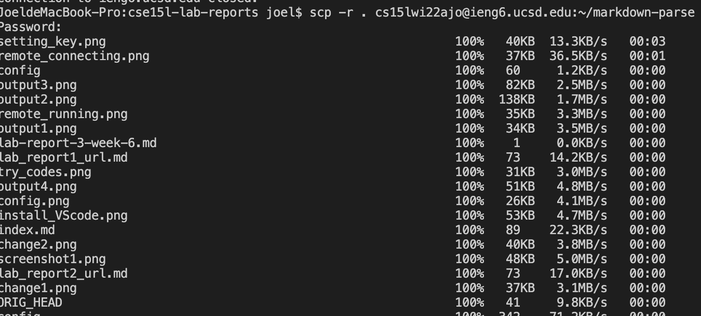

## Streamlining ssh Configuration

### config file

The host is ieng6

### ssh command

using code 'ssh ieng', I directly login to my account

### scp command

using code 'scp -r . cs15lwi22ajo@ieng6.ucsd.edu:~/markdown-parse',
I copy the whole file of markdown-parse to the server.

