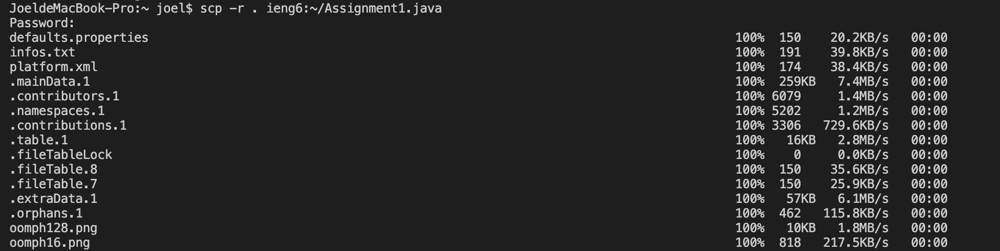

## Streamlining ssh Configuration

### config file

The host is ieng6

### ssh command

using code `ssh ieng6`, I directly login to my account

### scp command

using code `scp -r . ieng6:~/Assignment1.java`,
I copy a java file to the server.

