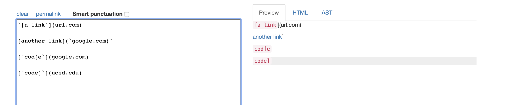

## output expected for three tests

the link should be `google.com for snippet1

the links should be `a.com`, `a.com(())`, and `example.com` for snippet2

the link should be  `https://ucsd-cse15l-w22.github.io/` for snippet3
