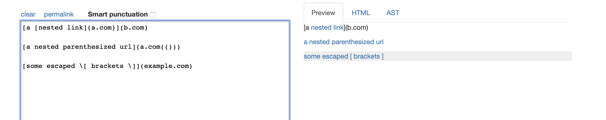
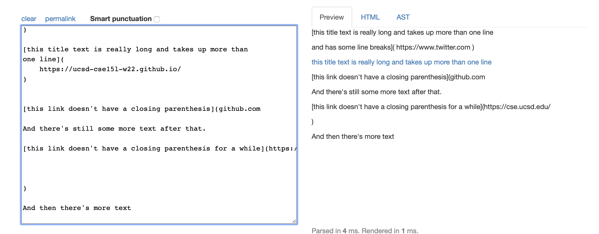

## links for markdown-parse respository

[link for my code](https://github.com/WEIGUOZENG/cse15l-lab-reports)

[link for code I reviewed](https://github.com/mBookUCSD/markdown-parse)

## output expected for three tests

the link should be `google.com for snippet1

the links should be `a.com`, `a.com(())`, and `example.com` for snippet2

the link should be  `https://ucsd-cse15l-w22.github.io/` for snippet3

## test code 

## test outcome for my implementation

## test outcome for implementation I reviewed

## answer for questions

For snippet1, I can use a loop to find two backticks, that can form an inline code, before parenthesis or brackets and assign the index next to the second backtick to variable currentIndex.

For snippet2, I can assign the close parenthesis or brackets to a variable and continuously update it before it reach the next open bracket or parenthesis. Thus the link would be between the first open parenthesis and the variable for last parenthsis and the description would be between the first open bracket and the the index provided by the variable for last close bracket.

For snippet3, I think small code change would not work because there need code for go next line when there is no parenthesis or brackets expected for a valid code and a long code to consider situation for when lines of contend should not be considered to be valid format when there are many brackets and parenthesis. 
