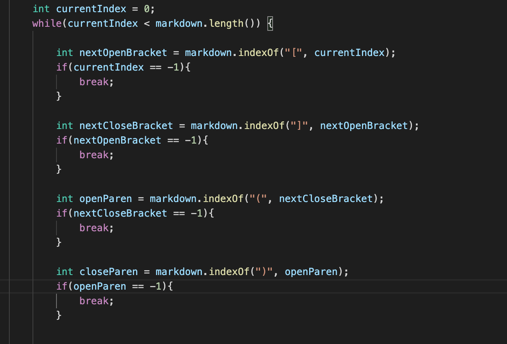
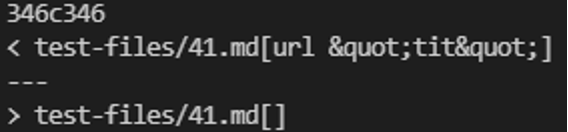

## Difference 1
I add a line in the code to print the name of the testfile after printing links in it.
Thus, using `diff` for results.txt of the two markdown-parses, I found there is a difference betweeen the results in line 106 of results.txt which is test-file194.
Output of my code is [baz] and of joe's code is [].
Both of our code have mistakes since the expected output should be [my_(url)].

# MY CODE:

## To give the expected output for this testfile:
I should change the while loop to find semicolon after the last close bracket after the first open bracket, then use `toReturn.add(markdown.substring(semicolon + 1, closeParen+1));` where 'semicolon' will be the index of semicolon to return the expected link.

## Difference 2
I also found a difference between the results in line346:

 when the expected result should be [].

## To give the expected output for this testfile:
I should add `int checkNum = 0;` and a for loop in the while loop after close parenthesis is found. The statement would be like `for(int i=openParen+1; i<closeParen; i++)` to get every arr type element in the String between two parenthesis. If statements in the for loop will check if the element at index i is a notation such as "&" or ";' and set checkNum to 1 and break the for loop if the argumrnt is ture. Then use an if statement after the for loop that break the while loop when checkNum is 1.
